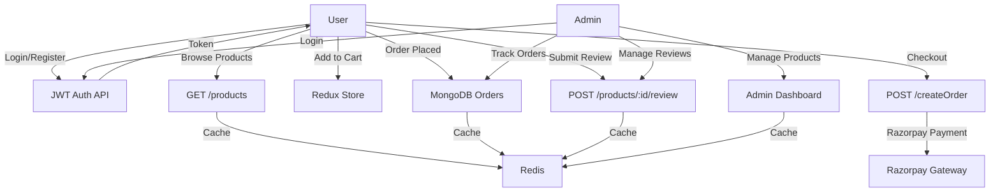
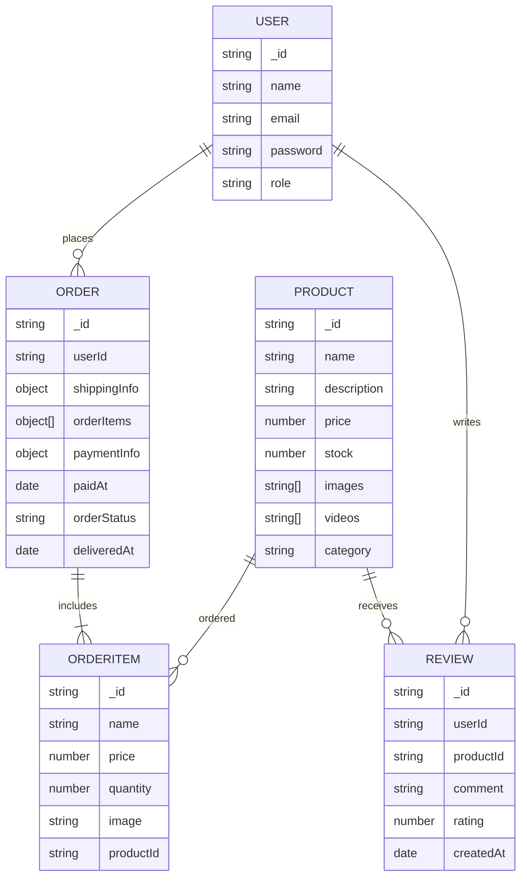

# 🛒 ShopBazar: Full-Stack E-commerce Platform


---

## 🚀 Overview

**ShopBazar** is a modern, production-ready E-commerce platform built with the MERN stack and Dockerized for seamless deployment. It offers secure JWT-based authentication with role-based access control, integrated payments via Razorpay, advanced admin dashboard functionalities, and efficient media delivery through Cloudinary.

---

## ✨ Features

- **JWT Authentication** with Role-Based Access (User/Admin)
- **Product Management** (CRUD for Admin)
- **Cart & Checkout** with Razorpay Payment Gateway
- **Order Management** with Tracking
- **Review System** with Ratings & Comments
- **Admin Dashboard** with Graphs & Metrics
- **Image/Video Uploads** via Cloudinary CDN
- **Redis Caching** for Performance Optimization
- **Dockerized Deployment** for Scalability

---

## 🏗️ Architecture

### System Flow



### Entity Relationship



## 🛠️ Setup & Installation

### Prerequisites
- Node.js 18+
- MongoDB 6+
- Redis
- Cloudinary Account
- Razorpay Account

### 1. Clone the repository
```bash
git clone <repo-url>
cd ecmm
```

### 2. Install dependencies
```bash
cd client && npm install
cd ../backend && npm install
```
### 3. Environment Variables
Create a `config.env` file in `backend/data`:
```
# Server
PORT=4000
NODE_ENV=Development

# Database
MONGO_URI=your_mongodb_connection_string

# JWT
JWT_SECRET=your_jwt_secret

# Frontend
FRONTEND_URI=http://localhost:3000

# Email (SMTP - Gmail)
SMPT_SERVICE=gmail
SMPT_MAIL=your_email@gmail.com
SMPT_PASSWORD=your_smtp_app_password
SMTP_SECURE=false

# Cloudinary
CLOUDINARY_NAME=your_cloudinary_cloud_name
CLOUDINARY_API_KEY=your_cloudinary_api_key
CLOUDINARY_API_SECRET=your_cloudinary_api_secret

# Razorpay
RAZORPAY_API_KEY=your_razorpay_api_key
RAZORPAY_API_SECRET=your_razorpay_api_secret

# Redis
REDIS_HOST=your_redis_host
REDIS_PORT=your_redis_port
REDIS_PASSWORD=your_redis_password

# Kafka
KAFKA_CLIENT_ID=email-service
KAFKA_BROKERS=kafka:9092
```
### 4. Start the project
- **Backend:**
```bash
cd backend
npm run dev
```
- **Frontend:**
 ```bash
cd ./client
npm start

```

### Local Access
- Frontend: http://localhost:3000
- Backend API: http://localhost:4000/

### Docker Deployment
- docker-compose up --build

---

##  Contributing
Pull requests are welcome! For significant changes, please open an issue first to discuss what you’d like to modify.

---

## 📄 License
[MIT](LICENSE)
