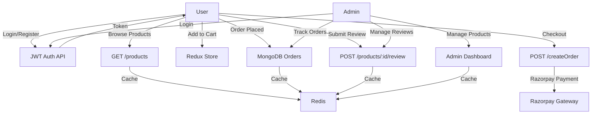

# 🛒 ShopBazar: Full-Stack E-commerce Platform


---

## 🚀 Overview

**ShopBazar** is a modern, production-ready E-commerce platform built with the MERN stack and Dockerized for seamless deployment. It offers secure JWT-based authentication with role-based access control, integrated payments via Razorpay, advanced admin dashboard functionalities, and efficient media delivery through Cloudinary.

---

## ✨ Features

- **JWT Authentication** with Role-Based Access (User/Admin)
- **Product Management** (CRUD for Admin)
- **Cart & Checkout** with Razorpay Payment Gateway
- **Order Management** with Tracking
- **Review System** with Ratings & Comments
- **Admin Dashboard** with Graphs & Metrics
- **Image/Video Uploads** via Cloudinary CDN
- **Redis Caching** for Performance Optimization
- **Dockerized Deployment** for Scalability

---

## 🏗️ Architecture

### System Flow



### Entity Relationship

```mermaid
  erDiagram
  USER ||--o{ ORDER : places
  USER ||--o{ REVIEW : writes
  ORDER ||--|{ ORDERITEM : includes
  PRODUCT ||--o{ ORDERITEM : ordered
  PRODUCT ||--o{ REVIEW : receives

  USER {
    string _id
    string name
    string email
    string password (hashed)
    string role
  }
  PRODUCT {
    string _id
    string name
    string description
    number price
    number stock
    image[] images
    video[] videos
    string category
  }
  REVIEW {
    string _id
    ref user
    ref product
    string comment
    number rating
    date createdAt
  }
  ORDER {
    string _id
    ref user
    object shippingInfo
    array orderItems
    object paymentInfo
    date paidAt
    string orderStatus
    date deliveredAt
  }

```
